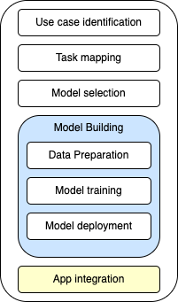

# How to reduce costs and improve performance of your Machine Learning (ML) workloads?
## AWS Machine Learning Purpose-built Accelerators Tutorial

In this workshop you'll learn how to use [AWS Trainium](https://aws.amazon.com/machine-learning/trainium/) and [AWS Inferentia](https://aws.amazon.com/machine-learning/inferentia/) with [Amazon SageMaker](https://aws.amazon.com/sagemaker/) and [Hugging Face Optimum Neuron](https://huggingface.co/docs/optimum-neuron/index), to optimize your ML workloads! You'll also learn a new methodology to map/qualify/implement end2end solutions for different business challenges. A **top-down** approach that starts with the **use case/business challenge** identification/mapping and ends with a trained model deployed as an API, which can be then integrated to your application.

Supposing you have a **business challenge** to address, which requires custom ML models. You need to prepare a dataset, train/deploy your models and finally integrate these models to your application (eventually automate this whole process). And, in the end, you expect to have a cost-optimized solution that fits into your budget.

The picture bellow shows the steps of the proposed methodology you need to follow in order to successfuly apply it to your own business problem:

  </img>

<table>
    <tr><td><strong>1) Use case identification:</strong></td><td>The first step of the process is to identify your use case. We prepared a table with a list of common use cases, framed as questions. The idea is to find the <b>Task</b> we'll use to address the problem.</td></tr>
    <tr><td><strong>1.1) Task mapping:</strong></td><td>After identifying the use case/business challenge, using the **use cases table** or your own judgment, now it is time to prepare a model for that given <b>Task</b></td></tr>
    <tr><td><strong>2) Model selection:</strong></td><td>There is a second table which lists all the current supported models and the <b>Tasks</b> it can implement. Use that table to select your model</td></tr>
    <tr><td><strong>3) Model building:</strong></td><td>Now, you can make use of the available notebooks to run: 1/ Data Preparation; 2/ Model fine-tuning and 3/ Model deploying. If you already have a pre-trained model, you can skip steps 1 and 2</td></tr>
    <tr><td><strong>4) App integration:</strong></td><td>In the previous step you deployed your model and it is now exposed as an API. Just integrate your application to this API and start using your model</td></tr>
</table>
            
## 1) Use case mapping

The following table brings a list of common use cases (framed as questions) and their associated tasks. Use this table as a reference to idenfity which **Task** is the best option to address your problem. Frame your use **case/business challenge** as a question and try to find the most similar option in the table. Then, use the task associated to the mappend use case, in the second column, and follow the next steps. 

**IMPORTANT:** If you don't find a use case (question) that resonates with your own use case, try to identify which **Task** is more appropriate for your scenario (using the tasks table). Also, please cut a ticket with the description of your use case + a framed question so that we can improve this table.

|Use case question|Task|
|:-|:-|
|How to create an auto-complete mechanism for my application?|CausalLM|
|How to create a chat-bot to answer questions from an FAQ to my customers?|QuestionAnswering|
|How can I summarize a long document into a few paragraphs?|CausalLM|
|How can I create a spam classifier for my emails?|SequenceClassification|
|How to check if a given text has a good or a bad comment?|SequenceClassification|
|How do I translate documents from multiple languages to dutch?|CausalLM|
|How to complete a sentence, given its initial words only|CausalLM|
|How to classify pictures of products into different classes?|ImageClassification|
|How to create an Alexa like mechanism which detects specific keywords?|AudioClassification|
|How to create subtitles to audiobooks?|Text-To-Speech|
|Given two sentences, how to make sure the second sentence is related to the first?|NextSentencePrediction|

### 1.1) Available Tasks

|Task|Description|
|:-|:-|
|SequenceClassification|Text classification - binary or multi class|
|MultipleChoice|Given a context and multiple options, the model predicts which one is correct|
|TokenClassification|Token classification assigns a label to individual tokens in a sentence. One of the most common token classification tasks is Named Entity Recognition (NER)|
|MaskedLM|When the input text has a mask that needs to be replaced by a generated term|
|QuestionAnswering|It answers questions bases on a context or on the acquired knowledge via training|
|CausalLM|Causal language modeling predicts the next token in a sequence of tokens, and the model can only attend to tokens on the left. This means the model cannot see future tokens|
|ConditionalGeneration|Fills a mask based on the conditions of the sentence|
|NextSentencePrediction|NSP consists of giving the model two sentences, sentence A and sentence B. We then say, ‘hey Model, does sentence B come after sentence A?’ — and Model says either IsNextSentence or NotNextSentence.|
|MaskedImageModeling|Predict masks of the objects in a given picture|
|ImageClassification|Classifies (binary or multiclass) an image into different classes of objects|

## 2) HF Optimum Neuron - Supported Models

[Click here to see the current supported models for training and inference in Hugging Face Optimum Neuron](purpose-built-accelerators/docs/optimum_neuron_models.md)

## 3) Model Building
Here you can find notebooks you can run on [Amazon SageMaker Studio](https://aws.amazon.com/sagemaker/studio/) to prepare a model that addresses a task associated to your own use case. They implement a solution for the following use case: **How can I create a spam detection mechanism?**. The required task is **SequenceClassification**. In the end we'll have a Binary Text classification model which receives a given email as input and return 0=NOT SPAM and 1=SPAM.

- The first notebook downloads a public dataset named **Deysi/spam-detection-dataset**. The dataset has already samples labelade as **spam** or **not spam**. 
- The second notebook is configured to train a **bert-base-uncased** for **SequenceClassification**. You'll notice there are variables you can configure to define the model and the task, then you define some hyperparameters and kick-off the training job using Amazon SageMaker.
- The third notebook shows how to compile a pre-trained model to AWS Inferentia and deploy it to a SageMaker real-time Endpoint which will exposes the model as a simple API (WebService).

**ATTENTION:** if you already have a trained model, compatible with the models listed in the table linked in section 2, then just use the third notebook (you don't need the first two in this case).

|Notebook|Description|
|-|-|
|[01 - Data Preparation](notebooks/01_DatasetPreparation.ipynb)|How to load and prepare a dataset for fine-tuning a model|
|[02 - Model Fine-tuning](notebooks/02_ModelFineTuning.ipynb)|How to kick-off a fine-tuning job using the dataset prepared in the previous notebook|
|[03 - Model Deployment](notebooks/03_ModelInference.ipynb)|How to compile and deploy a pre-trained model to Inferentia|

## 4) App Integration

If you followed the steps in the previous sections, you have a running SageMaker real-time endpoint with your model. Now you can make use of [AWS SDK for SageMaker runtime](https://aws.amazon.com/developer/tools/) which offers libraries available for the most common programming languages. If your application is Python based, you can also make use of [Amazon SageMaker Inference API](https://sagemaker.readthedocs.io/en/stable/api/inference/index.html).
