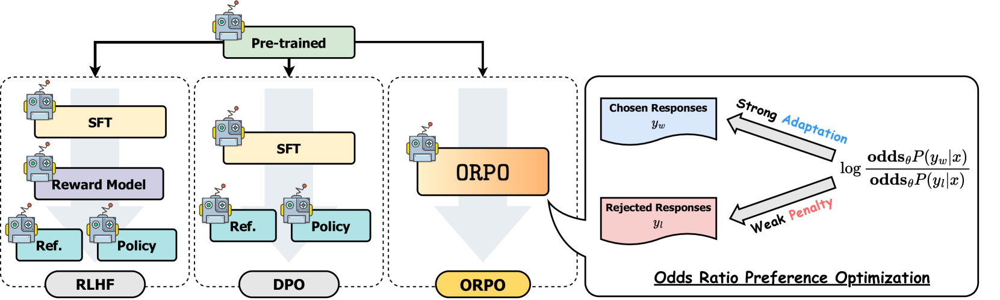
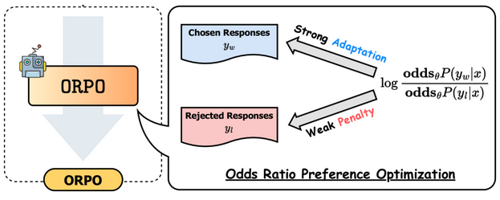
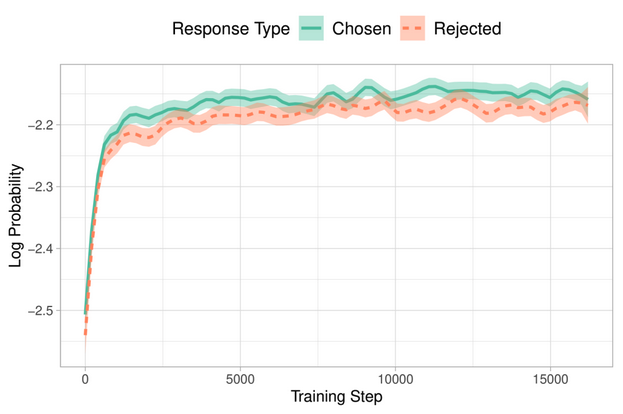

# Adapting LLMs for domain-aware applications with AWS Trainium post-training

## Introduction

Large language models are typically trained on a broad corpus of data from various domains, making them highly capable of handling diverse tasks and topics. However, when these models are deployed in specific domains or applications, their performance may not be optimal due to the domain-specific language, terminology, and context. Domain adaptation aims to fine-tune or adapt the pre-trained LLM to a particular domain or task, improving its performance and enabling better understanding of domain-specific data.

# Scenarios and Use Cases for LLM Domain Adaptation
LLM domain adaptation is useful in various scenarios where domain-specific knowledge or language patterns are crucial. Some common use cases include:

 - Specialized industries (e.g., healthcare, finance, legal, engineering)
 - Domain-specific applications (e.g., chatbots for customer service, virtual assistants for specific tasks)
 - Text summarization or generation for specific domains
 - Question-answering systems for domain-specific knowledge bases
 - Sentiment analysis or text classification in domain-specific contexts
 - Machine translation for domain-specific terminologies

# Techniques for LLM Domain Adaptation

**Supervised Fine-Tuning (SFT)**: In this approach, the language model is fine-tuned on a labeled dataset specific to the target domain or task. The model learns to generate outputs similar to the labeled examples in the dataset.
   - Use case: Fine-tuning a language model for legal document summarization, where you have a dataset of legal documents and their corresponding summaries.

**Reinforcement Learning from Human Feedback (RLHF)**: This technique involves providing human feedback (e.g., ratings, comparisons, or corrections) to the language model during the fine-tuning process. The model is trained to generate outputs that align with the human feedback, effectively shaping its behavior according to human preferences. RLHF can be particularly useful when you want to imbue the language model with specific traits, such as factuality, safety, or ethical behavior.
   - Use case: Training a language model for customer service applications, where it needs to provide helpful, polite, and factual responses.

**Direct Preference Optimization (DPO)**: DPO is stable, performant, and computationally lightweight, eliminating the need for sampling from the LM during fine-tuning or performing significant hyperparameter tuning.
   - Use case: Pre-training a language model on corrupted scientific paper abstracts to improve its performance on tasks related to scientific literature, such as question answering or text summarization.

**Odds Ratio Preference Optimization (ORPO)**: ORPO is a simple and novel monolithic alignment method technique which efficiently penalizes the model from learning undesired generation styles during SFT.
   - Use case: Adapting a general-purpose language model to the financial domain by training it with ORPO on a corpus of financial reports and news articles.

<p align="center">
  </img>
</p>

These techniques can be used individually or in combination, depending on the specific requirements and constraints of the domain adaptation task. The choice of technique often depends on factors such as the availability of labeled data, the desired traits or behaviors of the adapted model, and the computational resources available.

It's worth noting that domain adaptation is an active area of research, and new techniques and approaches are constantly emerging. Additionally, the effectiveness of these techniques can vary depending on the specific domain, task, and language model used.

# This workshop

For this particular workshop, we'll use ORPO, given its effienciency while managing the resources required to adapt our LLMs. It uses less memory to achieve similar results to DPO, resulting in a cheaper setup.

Duration: Approximately 60 minutes

## ORPO
[ORPO](https://arxiv.org/html/2403.07691v2) is a fine-tuning technique that streamlines the process of adapting LLMs to specific tasks. It addresses a limitation of the traditional two-stage approach. While SFT effectively adapts the model to a desired domain, it can inadvertently increase the probability of generating undesirable responses alongside preferred ones.



Here’s a breakdown of the issue:
 - Supervised Fine-Tuning (SFT): Trains the LLM on task-specific data, improving its performance in that domain.
 - Drawback: During SFT, the probability of generating undesirable responses along with preferred ones also increases, as shown in the image.



Preference alignment is then employed to address this issue. It aims to:

 - Increase the likelihood of generating preferred responses.
 - Decrease the likelihood of generating rejected responses.

Traditionally, preference alignment is achieved through techniques like Reinforcement Learning with Human Feedback (RLHF) or Direct Preference Optimization (DPO). However, these methods require a separate reference model, increasing computational complexity.

ORPO elegantly solves this problem by combining SFT and preference alignment into a single objective function. It modifies the standard language modeling loss by incorporating an odds ratio (OR) term. This term:

  - Weakly penalizes rejected responses.
  - Strongly rewards preferred responses.

By simultaneously optimizing for both objectives, ORPO allows the LLM to learn the target task while aligning its outputs with human preferences.

[For more details, you can check this blog post](https://huggingface.co/blog/mlabonne/orpo-llama-3).

In this workshop we'll use an implementation of ORPO provided by Hugging Face Optimum Neuron.

## HF Optimum Neuron

🤗 Optimum Neuron is the interface between the 🤗 Transformers library and AWS Accelerators including AWS Trainium and AWS Inferentia. It provides a set of tools enabling easy model loading, training and inference on single- and multi-Accelerator settings for different downstream tasks.

With Optimum Neuron you can bring your transformers training code and with minimal changes execute it on AWS Trainium. Here you can see an example of a training code compatible with Optimum Neuron.

```python
- from transformers import Trainer, TrainingArguments
+ from optimum.neuron import NeuronTrainer as Trainer
+ from optimum.neuron import NeuronTrainingArguments as TrainingArguments

from transformers import TrainingArguments
from optimum.neuron import NeuronTrainer as Trainer

def parse_args():
	...

def training_function(args):

    # load dataset from disk and tokenizer
    train_dataset = load_from_disk(os.path.join(args.dataset_path, "train"))
		...

    # Download the model from huggingface.co/models
    model = AutoModelForSequenceClassification.from_pretrained(
        args.model_id, num_labels=num_labels, label2id=label2id, id2label=id2label
    )

    training_args = TrainingArguments(
			...
    )

    # Create Trainer instance
    trainer = Trainer(
        model=model,
        args=training_args,
        train_dataset=train_dataset,
        eval_dataset=eval_dataset,
        compute_metrics=compute_metrics,
    )

    # Start training
    trainer.train()
```

For more information about HF Optimum Neuron, please [check the official documentation](https://huggingface.co/docs/optimum-neuron/index).
